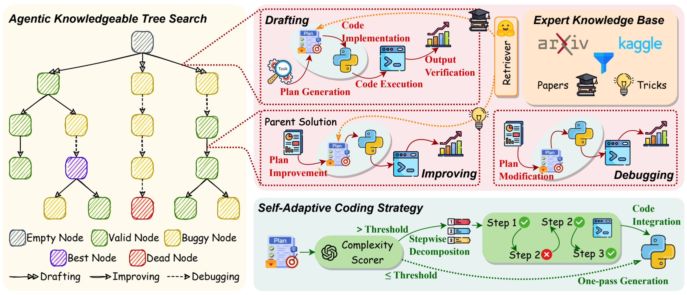

<div align="center">
<h2 align="center">AutoMind: Adaptive Knowledgeable Agent for Automated Data Science</p>

<h4 align="center">
  <a href="https://innovatingAI.github.io/" target="_blank">🌐Project</a> •
  <a href="https://arxiv.org/abs/2506.10974" target="_blank">📄Paper</a> •
  <a href="https://huggingface.co/papers/2506.10974" target="_blank">🤗HFPaper</a> •
  <a href="https://x.com/zxlzr/status/1933828029035532699" target="_blank">𝕏 Blog</a>
</h4>


 

[](https://opensource.org/licenses/MIT)

---

</div>

​**AutoMind**​ is an advanced LLM agent framework that automates end-to-end machine learning pipelines by dynamically integrating domain expertise, strategic solution exploration, and adaptive code generation. Unlike rigid workflow-based agents, AutoMind mimics human practitioners' empirical insights to solve complex, real-world data science challenges.

​🏆 **AutoMind**​ was evaluated on two automated data science benchmarks using different foundation model families. Our results demonstrate superior performance over baselines on both benchmarks: 
1. On the OpenAI's [MLE-bench](https://arxiv.org/pdf/2410.07095), AutoMind surpassed ​56.8%​​ of human participants - representing a ​13.5% improvement​ over prior state-of-the-art (AIDE).
2. Comprehensive efficiency analysis revealed ​300% increased efficiency and ​63% lower token costs​ compared to previous SOTA approaches.

✨ More specifically, **AutoMind** revolutionizes automated data science with these breakthrough features:  
1. **An expert knowledge base for data science**: Curated from domain expertise to ground the agent in empirical best practices, overcoming LLMs' inherent lack of human practitioner experience. This enables handling of complex, innovative tasks beyond classical problems.  
2. **An agentic knowledge tree search algorithm**: Strategically explores solution spaces through a structured search approach, dynamically navigating possible paths to optimize problem-solving efficiency and effectiveness.  
3. **A self-adaptive coding strategy**: Dynamically adjusts code generation complexity based on task requirements, moving beyond rigid workflows to deliver context-aware implementations—from simple scripts to cutting-edge solutions.  

## 🔔News

- <strong>[2025-06-24]</strong> We open-source the code for AutoMind. Thanks to all contributors for their great efforts!

- <strong>[2025-06-13]</strong> We release our paper [AutoMind: Adaptive Knowledgeable Agent for Automated Data Science](https://arxiv.org/abs/2506.10974).

## Table of Contents

- 🌟<a href="#overview">Overview</a>
- 🔧<a href="#environment-setup">Environment Setup</a>
- ⏩<a href="#running">Running</a>
- 🌻<a href="#acknowledgement">Acknowledgement</a>
- 🚩<a href="#citation">Citation</a>
- <a href="#contributors">Contributors</a>


## 🌟Overview

AutoMind revolutionizes LLM-driven data science automation by overcoming rigid workflows with three breakthroughs:  

🔍 **Expert Knowledge Base**  
Aggregates human expertise from 455 Kaggle competitions (3,237 top solutions) and top-tier research papers via intelligent hierarchical labeling.  

🌳 **Agentic Knowledge Tree Search**  
Dynamically explores solutions through drafting/improving/debugging cycles, generating validated plan-code-metric nodes.  

⌨️ **Self-Adaptive Coding**  
Generates single-pass code for simple tasks vs. Abstract Syntax Tree(AST) verified stepwise execution for complex pipelines.  



## 🔧Environment Setup

### MLE-Bench

To prepare MLE-Bench, you should first install `mlebench` with pip:

```
cd mle-bench
pip install -e .
```

Some MLE-bench competition data is stored using Git-LFS. Once you have downloaded and installed LFS, run:

```
git lfs fetch --all
git lfs pull
```

[Kaggle API]((https://github.com/Kaggle/kaggle-api)) is used to download the raw datasets. Ensure that you have downloaded your Kaggle credentials (kaggle.json) and placed it in the ~/.kaggle/ directory (this is the default location where the Kaggle API looks for your credentials).

The original MLE-bench dataset is a collection of 75 Kaggle competitions, which is a particularly resource-intensive benchmark to run. A single run of the original experiment setup of 24 hours per competition attempt requires 24 hours × 75 competitions = 1800 GPU hours of compute. Furthermore, running agents for the whole duration is very token-intensive.

Alternatively, you can download the [subset](mle-bench/experiments/splits/automind.txt) of MLE-Bench which consists of 16 competions used in our experiments via the following scripts:

```
mlebench prepare --automind 
```

To download and prepare the original MLE-bench dataset, run the following, which will download and prepare the dataset in your system's default cache directory.

```
mlebench prepare --all
```

You can also prepare the dataset for a specific competition by
running:

```
mlebench prepare -c <competition-id>
```

### Docker Sandbox

The code implementation and execution stage of AutoMind is designed to run in a Docker sandbox for security and reproducibility. If you want to run AutoMind locally on your machine, you need to set up the following prerequisites: 
- Install [Docker](https://docs.docker.com/engine/install/)
- Install [Sysbox](https://github.com/nestybox/sysbox)
- Install [NVIDIA Container Toolkit](https://docs.nvidia.com/datacenter/cloud-native/container-toolkit/install-guide.html) to run agents with GPUs

#### Base Environment

We first build a base Docker image by running:

```
bash scripts/build_base_env.sh
```

This will create a Docker image named `automind-base` with the necessary dependencies installed. Every time you want to update the base environment, you can run this script again to rebuild the image. To remove the dangling images not used, you can run the following command:

```
docker rmi -f $(docker images -f "dangling=true" -q)
```

## ⏩Running

To run AutoMind on MLE-Bench, you should run the following command:

```
bash scripts/run_mle_bench.sh
```

The content of `scripts/run_mle_bench.sh` is as follows:

```
export SUBMISSION_DIR=/home/submission
export LOGS_DIR=/home/logs
export CODE_DIR=/home/code
export AGENT_DIR=/home/agent

IMAGE_ID=$(docker build -q --no-cache --platform=linux/amd64 -t automind -f mle-bench/Dockerfile . --build-arg SUBMISSION_DIR=$SUBMISSION_DIR --build-arg LOGS_DIR=$LOGS_DIR --build-arg CODE_DIR=$CODE_DIR --build-arg AGENT_DIR=$AGENT_DIR)
echo $IMAGE_ID
python mle-bench/run_agent.py --agent-id automind --agent-name automind  --agent-dir automind --agent-config configs/mlebench.yaml --competition-set mle-bench/experiments/splits/automind.txt --data-dir /path/to/data --gpu-device 0
docker rmi $IMAGE_ID
```

Remember to replace `/path/to/data` with the actual path to the MLE-Bench dataset on your local machine. You can also specify the GPU device you want to use by changing the `--gpu-device` argument.

This script will build the Docker image as well as container for AutoMind and run the agent on the MLE-Bench dataset. The results will be saved in the `mle-bench/logs` directory.


## 🌻Acknowledgement

Our code for Agentic Knowledgeable Tree Search is built on top of [aideml](https://github.com/WecoAI/aideml/) framework. Our code for evaluation is implemented based on OpenAI's [mle-bench](https://github.com/openai/mle-bench). We thank all authors for their great contributions!

## 🎉Contributors

<a href="https://github.com/innovatingAI/AutoMind/graphs/contributors">
  </a>

We will offer long-term maintenance to fix bug for the project. Welcome for issues and PRs!

## 🚩Citation

Please cite our paper if you find AutoMind is useful in your work. Thanks!

```
@article{ou2025automind,
  title={AutoMind: Adaptive Knowledgeable Agent for Automated Data Science},
  author={Ou, Yixin and Luo, Yujie and Zheng, Jingsheng and Wei, Lanning and Qiao, Shuofei and Zhang, Jintian and Zheng, Da and Chen, Huajun and Zhang, Ningyu},
  journal={arXiv preprint arXiv:2506.10974},
  year={2025}
}
```
